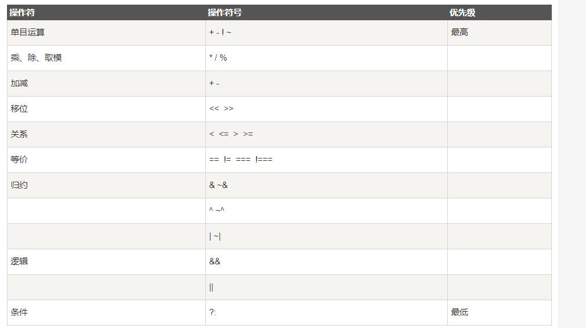

# Plan
时间： 2023年4月15日
地点：

2023-04-15 (09:00-11:30) 信息科学与技术导论
2023-04-15 (14:30-17:00) 多媒体技术与应用基础			*
2023-04-16 (09:00-11:30) EDA FPGA程序设计
2023-04-16 (14:30-17:00) 英语	测试

> 考试科目：	
> [file](<../0.笔记/统考笔试报考信息-2023年3月12日.png>)
> [所有科目](<../考试科目.png>)
> * 信息技术导论
> * 多媒体应用技术
> * 电子电路EDA技术
> * 英语（二）

# 报考个人信息、网址
[自考报名网站](https://zk.sceea.cn/)
[四川教育系统](https://www.sceea.cn/)
密码： normal
准考证号：070119389685


> To me
>  放平心态，一次失常无所谓，贵在坚持。

# 2023年4月15日： 考试原题
4月15日考试原题记录：

EDA：
嵌入式设计架构
一道12分，（有4个case分支）画出状态机转移图是啥。一分没有。。（必须了解状态机设计）
1. 二分频模块程序
2. case程序设计
3. EAD设计的特点
4. 电路抽象层，VerilogHDL可分为那几层
5. 为什么IP Core是未来的发展趋势
6. 按照集成度和 编程原件 分类，具体分类情况如何？
7. 根据VerilogHDL程序，画出状态机转移图（有四个case分支）

英语：
写一封电子邮件，给美国的tom告诉你找到了工作，包括：
	1. 工作内容；
	2. 为什么喜欢这份工作

信息技术导论：
简述信道是什么
信息处理的方法
数据安全的威胁

信息科学技术和计算机科学技术的联系
智能网络对社会和经济的影响

多媒体技术应用：
PS通道的概念，有那3种
GIF animotor 平面动画的制作 
  判断题 GIF anixx能保存动画和声音？
authorware将.7ap打包为可执行文件


# 学习计划：
* 学习平台的所有题先刷完
* 重点在EDA和多媒体， 其余两颗熟悉考试题

## 信息科学与技术导论

## * 多媒体技术与应用基础
1. 

## * 电子电路EDA
**教材**
1.  选择题 		45 - 80（已完成
2.  名称解释		91 - 108（已完成
3.  判断改错题	109 - 132
4.  简答题		133 - 160
		163.试用Verilog HDL描述一个异步复位、二十进制的减法计数器。
5.  程序分析题 	161 - 184
**教程**
1. Verilog HDL 程序		（P52-P120
2. 原理图， 电路图
	* 第一次， 随便画几个门级图， 乱连。 60分及格
	*  1. 输入在左边，输出在右边（得1/3）
	*  2. 
	*  熟悉所有门级，接线原理。
3. 门级电路


# 多媒体应用技术.md
> 教材： 多媒体技术与应用基础
> 四：5套试题+2套模拟题选择题、判断改错题必须要全部看完 	试题：1、2
> 五：简答题重点
1.简述多媒体数据压缩技术的必要性
2.简述MIDI格式声音文件的特点
3.简述变形动画的特点及应用场合。
4.请举出三种常用的图像文件格式，并对其做简要说明。
	PNG、JPG、GIF
5.简述Authorware 打包发布的操作过程。
6.简述位图与矢量图的区别。
7.简述ACDSee剪裁的图片制作壁纸的过程。
8.简述GIF 动画的特点。
9.简述超文本和超媒体的区别。
10.简述如何对音频信号进行采样。
11.请举出六种常见的计算机存储设备
12.简述使用Cool Edit Pro20对声音进行“降噪处理”的过程。
13.简述 Photoshop CS 的抠图技巧。|
14.简述视频处理软件Premiere Pro的用途。
15.简述Authorware软件的四个主要特点。
16.BMP 图像文件的结构由哪三部分组成?
17.列出至少4种常见的计算机存储设备。
18.列出至少3种获取视频素材的主要途径
> 六、综合题重点
1、声音或图片的存储量计算
	声音存储量=采样频率×量化位数×声道数×时间/8		CD：44.1Khz		广播：22.05Khz
	图片存储量=水平像素×垂直像素×每个像素色彩所需位数/8
2、Photoshop的使用
3、Authorware 的使用
4、暴风影音的使用
5、GIFAnimator 如何制作平面动画 
（ps:写给大家的重点在试题和模拟题当中可以找到相应的题型，要重点掌握，其次，测试题没有的重点可以在群相册当中找到，例如关于photoshop的使用，最后，大家在答题时千万别留空白，能写多写，祝大家逢考必过）
@全体成员


> 百科：
> 多媒体（Multimedia）是多种媒体的综合，一般包括`文本，声音和图像`等多种媒体形式。
> 在计算机系统中，`多媒体指组合两种或两种以上媒体的一种人机交互式信息交流和传播媒体`。使用的媒体包括`文字、图片、照片、声音、动画和影片`，以及程式所提供的互动功能。
	文本、图片、音视频


### 速记
1. win自带截屏： alt + Print Screen
2. 声音存储量=采样频率×量化位数×声道数×时间/8	
	声音数据化的数据量(Byte) =采样频率(Hz) x量化位数(bit) x声道数/8(B/s) x时间(s)
	CD：44.1Khz		广播：22.05Khz
3. 图片存储量=水平像素×垂直像素×每个像素色彩所需位数/8
	有1000张1280x1024分辨率，24位真彩色的图像： = 1280×1024×24/8×1000 ≈ 3750（M）
4. JPEG 算法是一种用于静态图像压缩的国际标准。， MPEG是动态，高质量音视频
5. 颜色特征：色调、色彩、饱和度
6. 声音三要素：音调、音色、响度

### 名词解释：
* 屏幕分辨率
* RGB模式
* 数据传输率
* 图像压缩
* 数模转换
* 相减混色
* 超媒体
* 超文本
* 图像分辨率


wma: 由微软公司开发的音频编解码格式，常用于在 Windows 系统中播放音乐和视频
fla: Flash的默认保存文件格式
MPEG： 高质量音视频文件 压缩标准
AVI：由 Microsoft 开发的多媒体文件格式，可以同时存储音频和视频数据。

mdb: 是 Microsoft Access 数据库的文件扩展名


### * 多媒体技术基本特征：
多媒体是`融合两种以上媒体的人机交互式信息交流和传播的媒体`，具有以下特点
1. 多样性一一信息载体的多样性: 相对于计算机而言的，即指信息媒体的多样性。
2. * 交互性一一是指用户可以与计算机的多种信息媒体进行交互操作从而为用户提供了更加有效地控制和使用信息的手段
3. * 集成性一一是指以计算机为中心综合处理多种信息媒体，它包括信息媒体的集成和处理这些媒体的设备的集成。
4. * 数字化一一媒体以数字形式存在（便于在计算机上进行复制有效的操作）
5. 实时性一一声音、动态图像 (视频) 随时间变化。
6. 可控性：

- [] 多媒体技术-信息载体
	包括文本、图像、视频、音频等，它们可以通过网络传输，可以用来传播信息、宣传产品、推广服务、传播新闻等。
- [] 媒体贮存信息的主体
	可以是ROM、RAM、硬盘、光盘、磁带等存储设备，也可以是计算机网络中的网络服务器以及云计算设备。

### 图像文件格式有：
1、JPEG格式，该格式具有很好的压缩比；
2、TIF格式，该格式印刷行业标准的图像格式；
3、GIF格式，此格式可以缩短图像的加载时间；
4、EPS格式；
5、BMP位图格式；
6、PCX格式等等；
7、PSD是Adobe Photoshop图像文件格式，它存储图像文件的像素数据，图层信息，调整图层，蒙版，注释，滤镜，颜色空间和其他图像处理数据。


### MPEG存储高质量音视频文件
MPEG是一种常用的视频和音频文件格式，它由Moving Picture Experts Group（MPEG）创建，可用于存储高质量的数字视频和音频文件。它通常用于存储视频和音频文件，例如电影，电视节目，音乐视频等。

常见的 VCD 是一种数字视频光盘，其中包含的视频文件采用了（MPEG ）视频压缩标准。


### 在音频数字化的过程中，对模拟语音信号处理的步骤依次为： 采样、量化、编码
1.采样：将模拟语音信号转换成数字化的采样点； 
2.量化：将采样点转换成一定精度的数值； 
3.编码：将数值转换成可存储的二进制码； 
4.压缩：将多余的数据删除，以达到节省存储空间的目的。 

### * 声音数据化的数据量(Byte)
* 公式： 声音数据化的数据量(Byte) =采样频率(Hz) x量化位数(bit) x声道数/8(B/s) x时间(s)、
* CD音频的采样规格定义为:采样频率为44100Hz， 采样位数为16bit。
若不经过压缩，5分钟的CD音质的双声道16bit 的音乐的数据量是多少?
答: 声音数据化的数据量(Byte) =采样频率(Hz) x量化位数(bit) x`声道数/8 (B/s)` x时间(s)
	数据量=44100x16x2/8x5x60=5920000Byte=53M
tips:  1分钟大约10M

cda音轨索引格式、
WAV波形声音文件（每分钟的音乐大约需要12兆磁盘空间）		一种标准数字音频文件		真实记录自然声波形等

* 采样频率：
每秒钟采集音频数据的次数。采样频率越高，音频保真度越高。计算机广泛配置的16位声卡，使用的采样频率通常包括11025Hz、22050Hz、44100Hz和48000Hz四种，其中，`采用11025Hz采样的声音效果相当于电话声音的效果；采用22050HZ采样的声音效果相当于FM调频广播的效果；采用44100HZ采样的声音效果相当于CD声音的效果。`	`22.05Khz 44.1Khz`
* 采样位数（振幅采样精度）：
即采样值或取样值，是用来衡量声音波动变化的一个参数，也是声卡的分辨率。它的数值越大，分辨率也就越高，发出声音的能力越强。目前计算机中配置的16位声卡的采样位数包括8位和16位两种。
* 声道数：
有单声道和立体声之分，单声道的声音只能使用一个喇叭发声（有的声卡也将单声道信息处理成两个喇叭同时输出），立体声的WAV可以使两个喇叭都发声（一般左右声道有分工），这样更能感受到音频信息的空间效果。显然，双声道数据还原特性更接近人们的听力习惯，但采集得到的数据量会增加1倍。


[WAV百科](https://baike.baidu.com/item/WAV?fromModule=lemma_inlink)


### 声卡 (Sound Card)也叫音频卡（港台称之为声效卡）
是计算机多媒体系统中最基本的组成部分，是实现声波/数字信号相互转换的一种硬件。声卡的基本功能是把来自话筒、磁带、光盘的原始声音信号加以转换，输出到耳机、扬声器、扩音机、录音机等声响设备，或通过音乐设备数字接口(`MIDI`)发出合成乐器的声音

声音三要素：音调、音色、响度

### CoolEdit是什么
CoolEdit是一款普及的数字音频编辑软件，它集多种音频处理功能，如音频编辑、处理、混音、制作等功能，是一款比较实用的音频编辑工具。
	如果对一篇课文进行录音，外界环境嘈杂，可选择（Cool Edit Pro）软件对其进行降噪处理。
	Cool Edit 编辑的多音轨文件工程保存的后缀名是（ .ses ）

### * CMYK 模式是什么：
CMYK模式是一种四原色印刷模式，它分别代表Cyan（青色）、Magenta（洋红色/品红）、Yellow（黄色）和Key（黑色）。它把这4种原色混合在一起，可以产生出一系列颜色。

### 动画 帧率
如果要让人的眼睛看到连续的动画或电影，画面刷新频率理论上应该达到		24 帧/秒
在动画制作中，一般帧速选择为（ 16 帧/秒 ），就可以比较流畅的播放动画	16 帧/秒


### ACDSee是什么
ACDSee是一款图像浏览、管理、编辑和分享软件，可以帮助用户更有效地浏览和管理各种图像文件，支持JPEG，TIFF，GIF，PNG，BMP，RAW（CRW，CR2，NEF，PEF，RAF，MRW），PSD，DNG和MPO文件格式。它还提供了丰富的编辑功能，可以调整图像的亮度，对比度，色调，饱和度等，并可以进行更复杂的图像处理，如图像裁剪，纠正，美容，添加边框等。


### HTTP
超文本传输协议（Hyper Text Transfer Protocol，HTTP）是一个简单的请求-响应协议，它通常运行在TCP之上。它指定了客户端可能发送给服务器什么样的消息以及得到什么样的响应。请求和响应消息的头以ASCII形式给出；而消息内容则具有一个类似MIME的格式。这个简单模型是早期Web成功的有功之臣，因为它使开发和部署非常地直截了当。

90、超文本的三个基本要素是（ ① 节点 ② 链 ③ 网络）

### * Dreamweaver
Dreamweaver是一种用于创建动态网页的网页设计软件。它可以帮助开发人员和设计师快速创建专业级网站，网页和应用程序。


### Authorware  多媒体创作工具**
`Authorware`是一种用于教育、培训、业务及演示的跨平台软件开发工具。它使用交互式多媒体来创建动态、可以在多种计算机平台上运行的应用程序。
Authorware是由Author（作家；创造者）和Ware（商品；物品；器皿）两个英语单词组成，顾名思义为"作家用来创造商品的工具"。Authorware最初是由Michael Allen于1987年创建的公司，而multimedia正是Authorware公司的产品。1970年代，Allen参加协助PLATO学习管理系统（Learning Management System，PLM）的开发。Authorware是一种解释型、基于流程的图形编程语言。Authorware被用于创建互动的程序，其中整合了声音、文本、图形、简单动画，以及数字电影。
	课件制作
**高频词汇**
1. 计算图标：  `14种功能图标` 主要作用在程序用到变量和函数时需要使用的图标
	它可以执行各种计算，例如加法、减法、乘法、除法、比较和逻辑运算等。
	是存放程序代码的地方
2. 热区交互、热区响应`支持11种交互作用响应`，每一种交互图标都能实现不同的功能。
	
3. Authorware的优点


**主要功能**
1．编制的软件具有强大的交互功能，可任意控制程序流程.
2．在人机对话中，它提供了按键，按鼠标，限时等多种应答方式.
3．它还提供了许多系统变量和函数以根据用户响应的情况，执行特定功能.
4．编制的软件除了能在其集成环境下运行外，还可以编译成扩展名为.EXE的文件，在Windows系统下脱离Authorware制作环境运行.
Authorware程序开始时，新建一个“流程图”，通过直观的流程图来表示用户程序的结构。用户可以增加并管理文本、图形、动画、声音以及视频，还可以开发各种交互，以及起导航作用的各种链接、按钮、菜单。MacromediaDirector的电影业可以整合到Authorware项目中。Xtras，或add-ins，也可以用于Authorware功能的扩展，这类似于HyperCard的XCMD。通过变量、函数以及各种表达式，Authorware的力量可以进一步地被开启。

**心得**
图标化编程软件？ 	通过图标来代替复杂的编程语言。


### 三、简答题
1、什么是多媒体技术?
答:多媒体技术是计算机交互式综合处理多媒体信息-- -文本、 图形、图像和声
音，使多种信息建立逻辑连接，集成为一个系统并具有交互性的技术。
2、声卡的基本功能有哪些?
答:进行数/模转换、模敞转换;实时、动态地处理数字化声音信号;立体声合
成;输入、输出声音等。
3、什么是虚拟现实技术?
答:虚拟现实是一项与多媒体密切相关的边缘技术，它通过综合应用图像处理、
模拟与仿真、传感、显示系统等技术和设备，以模拟仿真的方式，给用户提供
一个真实反映操作对象变化与相互作用的三维图像环境,从而构成-一个虚拟世界,
并通过特殊的输入输出设备给用户一个与该虚拟世界相互作用的三维交互式用
户界面。
4、试列举出五种多媒体数据类型，并为每种多媒体数据类型列出两种常用文件
格式(指出文件扩展名)
答:文本: txt doc;图形图像: bmp jpg;音频: mp3 wav;视频: avi mpg;动画:
swf gif。
5、促使多媒体技术发展的关键技术有哪些?
答: (1) CD-ROM解诀了多媒体信息的存储问题，(2) 高速计算机网络可以传
送多媒体信息; (3) 高速位处理技术、专用集成电路技术和亚微米集成电路技
术; (4) 多媒体压缩技术、人机交互技术和分布式处理技术。
6、简述衡量数据压缩好坏的标准。
答:衡量数据压缩技术的标准是: (1) 压缩比大; (2) 实现压缩的算法简单、
压缩、解压缩速度快; (3) 数据解压缩后，恢复效果好，尽可能地接近原始数
据。
7、简述位图图像与矢量图形的特点以及区别。
答: (1) 位图图像由`像素`构成，矢量图形由`基本图元`构成，(2) 如果绘制的图
形比较简单，那么矢量图形的数据量要远远小于位图图像; (3) 在矢量图形中
整个图形的色彩数目与文件的大小无关,而位图图像的颜色数目越多则数据量越
大; (4) 矢量图形在进行放大、缩小、旋转等变换操作后不会失真，位图图像.
在进行上述变换后图像质量会改变。
8、若不经过压缩，5分钟的CD音质的双声道16bit 的音乐的数据量是多少?
答: (1)声音数据化的数据量(Byte) =采样频率(Hz) x量化位数(bit) x声道
数/8 (B/s) x时间(s)
(2) CD音频的采样规格定义为:采样频率为44100Hz， 采样位数为16bit。
(3) 1M=1024KB， 1KB=1024Byte
数据量=44100x16x2/8x5x60=5920000Byte=53M
9、两分钟双声道、16位采样位数、22.05kHz 采样频率的声音，在不压缩情况
下数据量是多少?
答:声音数据化的数据量(Byte) =采样频率(Hz) x量化位数(bit) x声道数/8
(B/s) x时间(s)
所以:数据量=22050x16x2/8x120=10.09MB
10、描述使用Cool Edit对声音进行“降噪处理”的过程。
答:第一步，选择需要降噪的音轨，进入其波形编辑窗口。
第二步，用鼠标拖拽的方法，选取无声处的噪音，作为噪声采样标本。
第三步，在效果"标签中选取"噪声消除”>"降噪器”，单击“噪声采样"按钮，然
后单击确定"按钮退出。
第四步，用<CtrI+A>选取全部波形，然后再进入“降噪器"窗口，可用“预览”按钮
听处理结果，如满意，则点击"确定"按钮保存处理结果。
11、音频录制中产生声音失真的原因?
答:①信号频带宽,但采样频率不够高，数字音频信号发生混叠;
②模拟音频信号幅度太大，超过了量化器范围。
12、试举出五种获取声音素材的方法。
答:①素材光盘;②麦克风采集语音;③网络下载;④利用专门的软件抓取CD
或VCD光盘中的音乐;⑤创作MIDI 音乐。
13、简述WAV文件与MIDI 文件的主要区别。
答: WAV文件是Windows所使用的标准数字音频，称为波形文件，扩展名
为.wav。波形文件是由采样数据组成的，它所需要的存储容量很大，这是它最大
的缺点，故它不适合长时间记录声音。MIDI 音频是多媒体计算机产生声音的另
一种方式，扩展名为.MID. MIDI文件记录的不是声音本身，不对音乐进行采样，
它所记录的是声音的描述信息，如要演奏的音符、长度等。所以与波形文件相比
要小很多，节省磁盘空间，可以满足长时间音乐的需要。MIDI格式的主要限制
是它缺乏重新真实自然声音的能力，因此不能用在需要语音的场合。
14、请列举五种获取图形图像素材的方法。
答:软件制作;扫描仪扫描;数码相机拍摄;从屏幕、动画和视频中捕捉;素材
光盘和网络中获取等。
15、简述显示分辨率和屏幕分辨率的区别。
答:显示器分辨率是指计算机显示的物理分辨率，即显示器屏幕上的荧光粉点数
或像素数。屏幕分辨率是指实际显示图像时计算机所采用的分辨率，Windows
操作系统中可在计算机“显示"属性的“屏幕分辨率”中设置。
16、请简述图形与图像的区别。
答: (1) 图像是位图，是点阵图，由像素组成。优点:只要有足够多的不同色
彩的像素，就可以制作出色彩丰富的图像，逼真地表现自然界的景象。缺点:缩
放和旋转容易失真，同时文件容量较大。(2) 图形是矢量图，由数学向量组成。
优点:文件容量较小，在进行放大、缩小或旋转等操作时，图形不会失真。缺点:
不易制作色彩变化太多的图形。
17、名词解释:色彩模型里的CMYK 模式
答: CMYK模式以四色处理位基础，分别是青、品红、黄、黑，用这四种来叠加.
出各种颜色。
18、请描述矢量图与位图的区别。
答:矢量图是经过计算机而形成、具有方向和长度的矢量线段的集合。位图由排
成行列的像素组成。一般说来， 矢量图的数据量比位图少;位图由每个像素组
成，放大到- -定程序就会出现”马赛克"现象，而矢量图没有这个问题;在显示时，
位图比矢量图显示要快一些。
19、3DS MAX的制作动画的一般步骤是什么?
答:在3DSMAX中进行动画设计一般按照以下步骤进行: (1) 建立模型，(2)
选择材质; (3) 设置灯光、相机; (4) 设置动画; (5) 渲染并输出。
20、Premiere 具有哪些基本功能?
答: (1) Premiere 提供多个视频和音频编辑轨道，可以方便地对视频和音频进
行连接、复合等处理。对于视频，可以把视频文件按每一帧展开， 以帧为单位进
行编辑;
(2)可以实时采集来自视频卡、数码照相机的视频信号;
(3)可以对视频进行多种特技效果处理;
(4)可以给视频配上文字、图像、声音。
21、名词解释:视频卡
答:视频卡也叫视频采集卡，其作用是将模拟或数字视频信号转换成计算机的视
频文件。它是视频素材采集及制作的核心设备。
22、名词解释:帧频
答:帧频就是每秒显示的帧数。
23、名词解释:过渡动画
答:指需要提供开始和结束的两个关键帧的内容，中间过程由软件自动完成，可
实现移动、缩放、旋转、形状渐变、色彩渐变等的动画类型。
24、什么是关键帧动画?
答:所谓关键帧动画，就是给需要动画效果的属性，准备一组与时间相关的值，
这些值都是在动画序列中比较关键的帧中提取出来的，而其他时间帧中的值，
可以用这些关键值,采用特定的插值方法计算得到，从而达到比较流畅的动画效
果。
25、简述GIF动画的特点。
答: (1) GIF 的文件数据是一种基于Lzw算法的连续色调的无损压缩格式，
其压缩率-般在50%左右，不属于任何应用程序，几乎所有相关软件都支持。
GIF的图像文件数据是经过可变长度等压缩算法压缩。(2) 在一个GIF 文件中
可存放多幅彩色图像,若按一定速率在屏幕上播放多幅,即可构成最简单的动画。
(3)最多支持256色图像，是将多幅图像保存为一个图像文件从而形成动画，
图片质量低。
26、Dreamweaver 有以下几个基本特征?
答:①最佳的制作效率;②网站管理;③无可比拟的控制能力，④丰富模板
和XML支援;⑤多浏览器平台的支持。Dreamweaver最大的特点在于其全新的
软件操作界面、强大的动态网页编辑功能和开放的插件环境。
27、什么是超媒体?试述超媒体的两个应用。
答:①随着Web浏览器的出现，超文本的概念已不仅涉及文本，而且引申到
了元素。这种增强的、利用超文本的工作方法有时也称为超媒体，它以包括图形
和多媒体在内的这两种方式大大增强了Web 浏览器的表现能力。②使网页中
的图形本身成为一个链接。图形成为链接使浏览器变得更加直观。③使Web的
链接可以打开某一个程序，而显示并播放其中的图片、音频或视频剪辑。
28、超链接有几种分类方式，按照不同的分类方式可以分为哪些链接?
答:①按照连接路径的不同,网页中超链接-般分为以下3种类型:内部链接,
锚点链接和外部链接。②如果按照使用对象的不同，网页中的链接又可以分为:
文本超链接、图像超链接、电子邮件链接、锚点链接、多媒体文件链接、空链接
等。③网页超链接分为三种:绝对URL 的超链接，相对URL的超链接，同一
网页的超链接。④超链接还可以分为动态超链接和静态超链接。
29、网页制作的步骤是什么?
答:①根据要求确定网站内容;②规划网站栏目;③确定网页尺寸与版面布局;
④确定网站配色与风格;⑤收集网页所用素材;⑥利用软件制作网页;⑦测
试和发布网站。
30、名词解释:超文本
答:超文本是-种相对于传统的以线性的、有序的数据结构组成的文本，其收集、
存储和浏览相关信息是非线性、非顺序的网状结构文本。超文本是一-种信息管理
技术，也是一种电子文献形式。
31、简述超文本有哪些应用。
答:超文本与超媒体的组织和管理信息的方式符合人们的联想思维方式，适合于
非线性的数据组织形式，因而得到了广泛应用: (1) 办公自动化系统; (2) 大
型文献资料信息库系统; (3) 综合数据库系统应用，(4) 多媒体图形用户接口;
(5) Web网站的开发及应用。
32、为什么说Authorware 是基于图标和流程的多媒体创作工具?
答:因为Authorware 中提供了14 种功能图标，各种多媒体对象插入编辑排版
是通过图标来实现，交互、移动等功能也是由图标完成，甚至交互分支结构、
框架结构都是通过图标的设置来构件。-个Authorware作品的制作就是在流程
线上选择恰当的图标构件某种结构流程的过程。
33、试比较Authorware 和PowerPoint 两个工具的功能特点。
答: Authorware 是基于图标和流程线的多媒体创作工具。PowerPoint 是基于幻
灯片的多媒体创作工具。PowerPoint简单易学，可以很方便地将各种多媒体素
材组织在一张张幻灯片 上，制作演讲文稿。Authorware 作品的表现能力更强，
并可以支持多达11 种交互方式，它还晕粗通过函数、变量和语句编程实现更灵
活更深入的程序控制，对库、模块、知识对象和OLE、ActiveX嵌入技术的支持
使Authorware 具备了强大开发功能。.
34、请说明群组图标在流程设计种都起到了哪些作用?
答:当设计一个较大的作品时，经常会用到很多图标，且流程线也会比较复杂，
使用图标可以在大小有限的设计窗口种组织更多的图标，构造的模块化的结构
也会使流程变得清晰易读。
35、Authorware 可以添加的媒体对象有哪些?
答:声音、数字电影、视频、动态GIF、Flash 矢量动画、QuickTime 电影。
36、如何进行打包?
答:首先进行程序优化、媒体文件入库、设置文件的搜索路径等准备工作，然后
打开要打包的.a7p文件，选择菜单文件”的菜单命令“打包"。


# 信息技术导论
> 信息科学与技术导论

## 总则
[教学大纲](../1.信息技术导论/电子信息技术-信息技术导论（07874）教学大纲.doc)
二、	课程性质、目的和任务
本课程为电子信息技术专业必修课，其目是让学生熟悉并掌握信息科学技术的相关 知识，从系统整体建立对于信息科学技术初步而整体的认识，准确理解信息科学技术以 及其重要性，从宏观上把握信息科学技术的知识结构和学习方法，为将来专业知识的学 习奠定基础。
三、	教学基本要求
1、	掌握信息科学的基本概念；
2、	明确信息科学技术中信息获取、信息传递、信息处理、信息执行等作用与常用方法;
3、	熟悉信息科学技术中相关学科的关系，了解信息技术未来发展方向；
4、	掌握信息科学技术知识结构，建立一套有效的学习方法。

## 计划：
1. 先刷题库1-6， 后针对训练

## 课程介绍
### 第一章科学技术的发展与本质使命 
[file](<../1.信息技术导论/电子信息技术-信息技术导论（07874）课程学习指导书1.docx>)
[知识点]
科学技术的发展历史和发展规律，科学与技术的内涵、科学技术的本质使命。
[重难点]
科学与技术的内涵、科学技术的本质使命。

### 第二章信息的基础概念 
[知识点]
信息本体论层次定义、认识论层次定义、全信息概念，信息的八大特征、八个性质 与功能，信息科学研究对象、研究内容、研究方法以及研究目标。
[重难点]
信息的层次定义、全信息概念，信息特征、性质与功能。

### 第三章信息的获取
[知识点]
信息直接获取中传感器技术、传感器分类、常用传感器及工作原理，信号规整流程、 模拟信号、数字信号；信息间接获取的信号表示，信息特征获取，机器学习概念、系统 结构、学习策略，信息的检索内容手段与方法、信息的组织与存储方式、信息检索的发 展趋势。
[重难点]
信息直接获取中传感器的分类及常用传感器及工作原理、信号规整流程、模拟信号 与数字信号；机器学习概念、系统结构和学习策略；信息检索手段与方法。

### 第四章信息的传递
[知识点]
通信系统概念、通信系统的组成及各个组成部分的作用、通信系统的分类与常见通 信系统，通信网络发展、现代通信网的特征、通信网分类及发展趋势，信息安全、网络 安全威胁、网络安全技术、信息内容安全的威胁与主要技术。
[重难点]
通信系统组成及各个组成部分的作用、现代通信网络的特征与发展趋势，网络安全 技术、信息内容安全的威胁与主要技术。

### 第五章信息的处理
[知识点]
信号处理概念及处理环节、信息处理概念与分类、信号处理与信息处理的区别；模 拟信号处理、数字信号处理；常规信号运算、信号变换、信号滤波、信号频谱、特征提 取、信号检测与估值；智能信息处理理论与方法；信号与信息处理未来发展。
[重难点]
信号处理环节、信号处理与信息处理的区别，信号运算、信号变换方法、信号滤波、 信号频谱、信号特征提取概念，智能信息处理方法。

### 第六章信息的执行
[知识点]
信息控制基本概念、控制系统结构、基本控制方法（PID控制、最优控制、自适应 控制、智能控制），信息显示、信息显示的基本方法。
[重难点]
控制系统结构、基本控制方法、信息显示基本方法。

### 第七章信息科学与计算机科学、自动化科学的关系
[知识点]
计算机科学的概念、发展过程、研究内容；信息科学技术与计算机科学技术的联系； 自动化科学的概念、发展过程、研究内容，信息科学技术与自动化科学技术的区别与联
[重难点]
信息科学技术与计算机科学技术的联系；信息科学技术与自动化科学技术的区别与 联系。

### 第八章信息科学的知识结构与学习方法
[知识点]
知识结构概念、知识结构的特征、信息科学技术的知识结构，大学学习和知识结构 的关系、信息科学技术的能力结构、能力结构的定义和概念、大学生的基本能力结构、 信息科学技术人才的专业能力结构；学习方法对学习成功的表现、信息科学与技术类专 业的学习任务与要求。
[重难点]
知识结构的概念、信息科学技术的知识结构、信息科学技术人才的专业能力结构、 信息科学与技术类专业的学习任务与要求。

### 第九章信息科学未来趋势
[知识点]
未来信息技术、新型信息材料、新型信息器件、智能信息系统；未来信息网络、下 一代网络（NGN)。
[重难点]
未来信息技术、新型信息材料、新型信息器件、智能信息系统；下一代网络（NGN)。 

### 第十章信息科学与社会相互影响和相互作用 [知识点]
大科学观要义、信息科学技术在经济和社会领域的相互影响及相互作用、信息社会 的生产图景。
[重难点]
大科学观要义、信息科学技术在经济和社会领域的相互影响及相互作用。

## 笔记

### 名词解释： 关键词、高频词汇

### 信号运算包括:
常规运算（线性运算、乘除运算）、数学运算（微分运算、积分运算）、波形变换（反转运算、时移运算、压扩运算）、关联运算（卷积运算、相关运算）。

### 模数 转换
1、模拟量：在时间上或数值上都是连续的物理量称为模拟量。
2、数字量：在时间上和数量上都是离散的物理量称为数字量。

### 傅立叶变 是什么
ChatGPT
傅立叶变换是一种将信号从时间域（时域）转换到频率域的数学变换方法。它将一个信号分解成若干个不同频率的正弦和余弦函数的叠加，可以用来分析信号的频谱特性。傅立叶变换在信号处理、通信、图像处理等领域有广泛的应用。

### 信号检测
是一种数学技术，它通过分析信号的特征来识别有用信息，以及噪声和其他不重要信息的抑制。它涉及到一系列数学算法，包括傅里叶变换、短时傅里叶变换、小波变换、滤波器等。

### 信号运算
信号运算包括常规运算（线性运算、乘除运算）、数学运算（微分运算、积分运算）、波形变换（反转运算、时移运算、压扩运算）、关联运算（卷积运算、相关运算）。

### 名词解释题
16.强化学习：强化学习是一种让计算机通过不断尝试获得最佳结果的机器学习方法。 17.能力结构：能力结构是指机器学习算法中模型与实际任务之间的关系。 18.入侵检测：入侵检测是一种网络安全技术，用于检测未经授权的访问和操作。 19.人工智能：人工智能是一种构建计算机系统，以实现人类智能行为的科学。 20.特征提取：特征提取是机器学习中提取输入数据中有用信息的过程。


## 解答题：

### 按照使用范围，通信网络可分为哪几类
按照使用范围，通信网络可以分为以下几类：
个人局域网（PAN）：是指个人使用的局域网，通常涉及的范围很小，例如蓝牙连接的设备等。
局域网（LAN）：是指在同一建筑物或校园范围内连接的计算机和设备组成的网络。
城域网（MAN）：是指连接在同一城市范围内的局域网、广域网等网络。
广域网（WAN）：是指广泛分布在不同地理位置的计算机和设备组成的网络，通常通过互联网连接。
全球性网络（Internet）：是指全球范围内互联的网络，由无数个网络和计算机组成，是目前最大、最复杂的网络。
专用网络：是指为特定应用或行业定制的网络，例如工业控制网络、医疗保健网络等。
无线传感器网络（WSN）：是指由大量分布在空间中的传感器节点组成的网络，用于实现环境监测、智能交通等领域。
每一类网络的具体含义如上所述，不同的网络根据其使用范围和特点，具有不同的应用场景和技术特点。


> 
5 、什么 是科学？

答：科学是人类创建的一种关于自然和社会（因而也包括人类自身）的本质以及他

们的运动规律的开放理论知识体系，它在长期的社会实践过程中被人们发现、提炼和抽

象出来，有经过长期社会实践的检验而逐渐得到确立和更新。

6 6 、什么是技术？

答：技术是人类创造的一种关于如何认识自然和如何改造自然的工艺方法体系，他

在长期的社会实践过程中被人们总结出来，或者在科学理论指导下发明出来，经过实践

检验证实而确认和应用。

7 7 、 科学技术的本质使命是什么？

答：科学技术的本质使命是利用外部资源，创造先进工具，扩展人类能力。

8 8 、 科学与技术之间有什么关系？

答：科学是人类创建的一种关于自然和社会（因而也包括人类自身）的本质以及他

们的运动规律的开放理论知识体系，它在长期的社会实践过程中被人们发现、提炼和抽

象出来，有经过长期社会实践的检验而逐渐得到确立和更新。

技术，也叫工艺学没事人类创造的关于如何认识自然和如何改造自然地工艺方法体

系，它从实践过程中被人们逐渐总结出来，或在科学理论指导下被人们发明出来，经过

实践的检验而逐渐得到确认和应用。

科学史关于事物本身的本质及其运动规律，是关于事物本身的知识体系；技术是人

类创造出来用以解决问题的方法，是关于如何认识自然的如何改造自然地方法体系。它

们之间存在一种相互作用相互促进的关系，科学理论可以知道人们发明创造新的更好的

技术方法和技术工具，而技术方法和技术工具又可以反过来帮助人们更好的认识对象的

本质和运动规律。

10 、 信息有什么样的特征 ？

答：信息来源于物质，当又不是物质本身，他从物质的运动中产生出来，又可以脱

离原物质而寄生他物质，相对独立存在；

信息也来源于精神世界，但是有不限于精神领域；

信息与能量密切相关，但是有与能量有质的区别；

信息可以被提炼成知识，但信息本身不等于知识；

信息是具体的，可以被主体所感知、处理和利用；

信息可以被复制，可以被共享；

语法信息在传递和处理过程中永远不增值。

11 、信息有什么样的性质？

答：普遍性；无限性；相对性；传递性；变换性；有序性；动态性；转换性

7 7 、解释 “ 霍尔效应 ”

答：通电的导体或半导体，在垂直于电流和磁场的方向上将产生电动势的现象。

8 8 、解释 “ 传感器 ”

答：能够感受规定的被测量并按照一定规律转换成可用输出信号的器件或装置。

9 9 、解释 “ 压电效应 ”

答：一些离子型晶体的电介质，当沿着一定方向对其施力使它变形时，内部就会产

生计划现象，同时在它的两个表面上产生符号相反的电荷；当外力去掉后，又重新恢复

到不带电状态；当作用力方向改变时，电荷机型也睡着改变，这种现象称为压电效应。

10 、按照物理原理分类，有哪些种类的传感器? ?

答：分为电参量式传感器、磁电式传感器、压电式传感器、光电式传感器、离电式

传感器、热电式传感器、波式传感器、射线式传感器、半导体式传感器、以及其他原理

的传感器。

11 、什么叫机器学习？

答：主要研究机器如何模拟或实现人类的学习行为，以获取新的知识和能力，重新

组织已有的知识结构，使之不断增强自身性能。

12 、 机器学习的策略有哪几种 ？

答：机器学习的策略是指学习过程中系统所采用的推理策略。包括机械学习、示教

学习、严以学习、类比学习、解释学习、归纳学习、强化学习七种。

12 、 什么叫信息检索 ？

答：信息检索是指将信息按一定方式组织和存储起来，然后在用户需要进行找出相

关信息的过程。

13 、 怎样进行信息检索 ？

答：分析与研究课题；选择检索系统或数据库；确定检索途径；编织检索提问式。

1 14 4 、 什么是测量 ？ 它有什么作用 ？

答：测量是为确定本测量对象的量值而进行的处理过程。测量是用数字语言描述周

围世界的重要手段，任何科学的结论都离不开测量，测量技术的进步会大大促进科学技

术的发展。

15 、 目前机器学习面临哪些挑战 ？

答：机器学习面临的挑战有：提高学习的泛化能力、加快训练速度和测试速度、提

供学习系统的可理解性、如何利用未标记的数据、降低学习的错误率、在达到较低的总

错误率的基础上如何“趋利” 、如何“避害”等。

16 、简述信息检索发展趋势

答：信息检索智能化。

在信息检索中，用户期望用简单的检索不走就能获得高校准确的检索结果。智能信

息检索顺应了这一要求，可以在一定程度上模拟人脑的思维方式，分析永和以自然语言

表达的检索请求，在自动形成检索策略进行智能、快速、高校的信息检索。智能信息检

索系统具有理解能力和学习能力，能在理解信息内容（利用故意信息）的基础上获取知

识，能直接向文本学习，并在时间中实现自我完善。

信息检索可视化

将数据库中的内容用图像形式可视化显示为用火的过程，可视化检索有许多优点，

主要变小在：可以为用户提供更丰富和更直观的信息；使用户可以进行交互式输入，允

许在信息空间进行动态移动，允许用户修改数据的显示方式，使他们理解数据的个人偏

好；减少理解健硕结果的时间，可以对星光信息进行聚类分析，从而帮助人们发现新的

科学点；检索结果可以模仿网络环境形成拓扑结构图，在拓扑结构如中所有相关文献或

其他类型资源将被归为同类；一个透明的检索过程使检索更容易更有效。

信息检索个性化

信息检索的个性化是指检索系统提供内容的特色化、服务的个性化。随着检索工具

个性化功能的不断强化，用户可以用自己喜欢的方式来检索信息，预先选择自己的信息

员，想自己感兴趣的、指的自己醒来的信息员提问，而且能对检索结果进行阶段限定，

提高检索质量。

11 、 解释 “ 信宿 ”

信宿与信源相对应，猴子是通信信息的出发点，器功能上 hi 产生信息；前者是通信

信息的归宿，器功能是接收信息12 、 说明通信系统模型的组成 ， 并论述各部分功能

答：通信系统包含一下基本组成部分：

信源：根据输出信息的形式不同，可把信源划分为模拟信源和离散信源。模拟信源

输出时间连续的幅度信号，离散信源输出时间离散的符号序列。

编码器：编码器介于信源与信道之间，它的功能是将信源输出转化成适合于信道传

输的信号。

信道：是信号的传输媒介，它把调制器输出信号传送到接收端。

译码器：从信道编码信号中回复信号，实现与编码器相反的功能。

信宿：它与信源相对应，信宿是通信信息的归宿，其功能是接收信息。

12 、解释 “ 模数转换 ”

把模拟信号变成数字信号，是一个队自变量和幅值同时进行离散化的过程，基本的

理论是采样定理。

1 13 3 、 解释 “ 人工神经网络 ”

是由一个大量的简单处理单元（神经元）组成的高度复杂的大规模非线性自适应系

统，是对人脑系统的一阶特性的一种近似描述。

14 、说明常规信息处理与智能信息处理的区别

答：常规信息处理主要指签署的信号处理和浅层信息处理。智能信息处理则是深层

信息处理，主要包括识别、分类、整合、推理等，比较强调处理的目的是从信息中获取

新的信息和知识。且曾信息处理只涉及“语法信息” （形式） ，深层信息处理（智能信息

处理）则还涉及“语义信息” （内容）和“语用信息” （价值）

1 15 5 、数字信号处理的概念及步骤？

数字信号处理是将信号用数字方式表示并进行处理的理论和技术。其步骤有：数模

转换；数字信号处理；模数转换

1 16 6 、 什么是智能信系统 ？

答：通过采用智能信息技术，信息系统不仅能帮助人们完成收集、整理以及简单处

理信息的工作，而且还能辅助人们分析、运用各类信息和知识应对实际问题。

1 17 7 、常规信息处理的方法有哪些？

答：信息运算；信息变换；信息滤波；信息的谱分析；特征提取；信号检测与估计

1 18 8 、什么叫虚拟现实？它有什么作用？

答：利用计算机生成一种模拟环境，通过多种传感设备使用户“投入”到该环境中，

实现用户与该环境直接进行自然交互。虚拟现实能使人机界面从以视觉感知为主发展到

包括视觉、听觉、触觉、力觉和嗅觉等多种感觉通道感知，从以手动输入为主发展到包

括语音、收拾和视线等多种效应通道输入。

12 、解释 “ 模数转换 ”

把模拟信号变成数字信号，是一个队自变量和幅值同时进行离散化的过程，基本的

理论是采样定理。

1 13 3 、 解释 “ 人工神经网络 ”

是由一个大量的简单处理单元（神经元）组成的高度复杂的大规模非线性自适应系

统，是对人脑系统的一阶特性的一种近似描述。

14 、说明常规信息处理与智能信息处理的区别

答：常规信息处理主要指签署的信号处理和浅层信息处理。智能信息处理则是深层

信息处理，主要包括识别、分类、整合、推理等，比较强调处理的目的是从信息中获取

新的信息和知识。且曾信息处理只涉及“语法信息” （形式） ，深层信息处理（智能信息

处理）则还涉及“语义信息” （内容）和“语用信息” （价值）

1 15 5 、数字信号处理的概念及步骤？

数字信号处理是将信号用数字方式表示并进行处理的理论和技术。其步骤有：数模

转换；数字信号处理；模数转换

1 16 6 、 什么是智能信系统 ？

答：通过采用智能信息技术，信息系统不仅能帮助人们完成收集、整理以及简单处

理信息的工作，而且还能辅助人们分析、运用各类信息和知识应对实际问题。

1 17 7 、常规信息处理的方法有哪些？

答：信息运算；信息变换；信息滤波；信息的谱分析；特征提取；信号检测与估计

1 18 8 、什么叫虚拟现实？它有什么作用？

答：利用计算机生成一种模拟环境，通过多种传感设备使用户“投入”到该环境中，

实现用户与该环境直接进行自然交互。虚拟现实能使人机界面从以视觉感知为主发展到

包括视觉、听觉、触觉、力觉和嗅觉等多种感觉通道感知，从以手动输入为主发展到包

括语音、收拾和视线等多种效应通道输入。

6 6 、一个简单的控制系统一般包含哪几部分？

答：一个简单的控制系统包括控制器、执行器、传感器、被控对象。

7 7 、 什么是自校正控制 ？ 其控制原理是什么 ？

答：自校正控制石油被控对象、参数估计器、控制器和控制器设计计算等部分组成。

参数估计和控制器设计必须在线、实时实现。

自校正控制原理是：参数估计器实时、在线估计被控对象的参数变化，然后根据被

控对象参数来进行控制器设计、调整控制器参数。这样。 ，当被控对象参数变化时，控制

系统能够检测这一变化并据此调节控制器，以保持控制系统的性能品质。

4 4 、 什么是计算机科学技术 ？

答：计算机科学技术是描述和处理信息的算法理论与技术，包括理论、分析、设计、

效率分析、实现和应用系统研究。

5 5 、 结合所学知识 ， 谈谈你对信息科学技术的和计算机科学技术的理解及他们的区别与

联系

4 4 、 什么是计算机科学技术 ？

答：计算机科学技术是描述和处理信息的算法理论与技术，包括理论、分析、设计、

效率分析、实现和应用系统研究。

5 5 、 结合所学知识 ， 谈谈你对信息科学技术的和计算机科学技术的理解及他们的区别与联系

答：信息科学与计算机科学技术的区别：

计算机科学主要集中在研究与信息处理相关的理论、 方法与应用上， 目前主要包括：

可计算机性理论、算法设计与复杂性分析、密码算法与信息安全、分布式计算理论、并

行计算理论、生物信息计算、计算几何学、程序语言理论等。侧重于计算本职以及基于

计算的各种工具的研究，并应用这些工具来设计和开发。

信息科学是以信息为研究对象、以信息过程的全部归零为研究内容、以信息科学方

法论为知道、以研究扩展人的信息功能为研究目标的科学。他的研究覆盖了整个信息的

过程，包括信息理论、信息获取、信息传递、信息处理、新信息认知与决策、信息执行

以及信息系统的优化。他侧重于信息本职和基于信息本职的各种信息系统的研究。

综上所述，任何计算机都是信息系统，当不能认为所有信息系统都是计算机；任何

计算郭富城都是信息过程，但不能认为所有信息过程都是计算过程。

信息科学技术与学计算机科学技术的联系：

信息科学的发展离不开其他相关科学的支持，通信技术和计算机与智能技术出在整

个信息技术的核心位置，感测技术和控制技术则是核心与外部世界之间的接口。没看有

通信和计算机与智能技术， 信息技术就失去了基本的意义； 二没有感测技术䄦控制技术，

信息技术就失去了基本的作用： 一方面没有信息的来源； 另一方面也失去了信息的归宿。

、知识结构是如何形成的？其作用是什么？

答：知识是人类头奶中的积累过程使一种建构过程，时间活动中产生的每一个新的认识结果，作为一种新知识都要奶如到原有知识群的网络结构中，安排到一个适当的位

置上并与其他相关的知识建立联系。 这种安排， 就可能引起原有知识结构的调整和变化，

若是关于一致对象的新知识，就会是原油的知识更新，向纵深发展；若是关于新对象的

知识，就会建立起新的知识系列，往横广方向发展，从而建立起更合理的知识结构。

11 、信息素养包括哪些方面的内容？

答：信息意识；信息知识；信息能力；信息道德

12 、 知识结构具有哪些特征 ？

答：整体性；层次性；动态性

13 、 什么是科学的学习方法 ， 总结中学的学习过程与学习方法并结合现在的大学生活及

大学的学习任务，谈谈你将来如何扬长补短、 运用科学的学习方法完成大学学业

答：科学的学习方法是构成人的学习能力的主要内容和灵魂，而它在人们的学习实

践中直接、具体的实时和运用就会转换为实际的学习能力。科学的学习方法有：听讲法、

直观法、复现法、问题探索法、归纳法、演绎法。

结合自身阐述……

6 、 智能信息网络有什么经济和社会意义 ？

答：利用智能化信息网络可以使科学研究、文化教育、国防事业、管理决策、交通

运输、商业贸易、医疗卫生、社会服务、人际交往、国际交流、体育娱乐以致家庭劳作

实现高度的现代化。

普遍采用大规模智能化信息网络将可以是社会的物质产品空前的丰富多彩，充分的

满足社会日益增长的物质需求。

7 7 、试论述未来信息科学技术发展方向？

答：结合课本从以下四方面论述：

新型信息材料

新型信息器件

智能信息系统

智能信息网络

4 、 信息社会对我们现在的生活有哪些方面的影响？

答：为教育插上翅膀：多媒体教学、数字化考试、无纸化考试、互动式课堂、虚拟

学校。为帮贡拓展新天地：办公自动化、流动办公室。为民生提供好帮手：电子购物、

网络银行。为出行提供便捷。为健康提供名医。

5 5 、试分析信息科学技术在经济和社会领域引发的连锁反应

答：主要从以下 5 方面论述

信息时代的社会需求；

社会需求对信息科学的牵引；

信息科学对信息技术的启迪；

信息技术孕育了信息经济；

信息经济正在催生信息社会。

6 6 、 试论信息社会的含义及其发展阶段

答：信息社会就是脱离工业化社会以后，信息将起主要作用的社会。在信息社会中，

信息成为比物质和能源更为重要的资源，以开发和利用信息资源为目的信息经济活动迅

速扩大，组件取代工业生产活动二成为国民经济活动的主要内容；信息经济在国民经济

中占据主导地位，并构成社会信息化的物质基础；以计算机、网络、通信为主导的信息

技术革命是社会信息化的动力源泉；信息技术在生产、科研、教育、医疗、企业和正负

管理一体及家庭中的广泛应用对经济和社会发展产生了巨大而深刻的影响，从根本上改

变了人们的生活方式、行为方式和价值观念。


# 电子电路EDA技术
> 基于FPGA的现代数字系统设计
* -[Verilog 教程](https://www.runoob.com/w3cnote/verilog-process-assign.html)

1.试卷必须写满
2.程序分析题，一般2-3道，可以相互参考
3.编程题，一般2饭，参考程序分析题
4.状态机程序，必须背下来一个
5.判断题，如果不知道对错，按错的处理，除非确认正确
6.考试期间，对一道题不要占用太多时间，先把会的做了，剩余时间，优先处理编程和程序分钟，然后是简答和名词解释，最后快速完成选择和判断


## PLAN:
关键字熟悉：			（？
always

> 模块名
module		endmodule


> IO端口
input
output
inout

> 数据类型
wire	线网型， 与硬件直连
reg		寄存器型

位状态：
	0、1、x、z：		x：未知； z：高组态

memory
parameter	常数参数
integer		整数

> 模块功能
assign：	连续赋值语句

always
initial

task
function

> TBD


always @ (posedege clk)			// 当时钟上升沿到来时， 触发always块执行；
1. always是为了描述硬件的行为，只可以在module或者interface中使用，在使用时需要注意：哪种使用方式是时序电路描述，哪种使用方式是组合电路描述,其反复执行
2. always中的@(event..)敏感列表是为了模拟硬件信号的触发行为，因此要根据描述的是组合电路还是时序电路定义信号触发行为


initial
forever

posedge clk：	上升沿


wire[3:0] Q;		wire[8-5:0] Q;		
Q[0] ~ Q[3];		// 每一位一次访问


## 总则：
> ** 熟悉FPGA- Verilog HDL语言：
> 程序设计思路
> Verilog HDL语法： 函数、变量、赋值&优先级等
> 

> ** 程序
> 电路图： 与或非、门电路
> 状态图： 


[VHDL语法手册](https://zhuanlan.zhihu.com/p/129243480?utm_id=0)

异或：	^
	两值不相等则为真





## 关键字

``` Verilog
initial 与 always
		
	在仿真一开始它们都会同时执行，即initial和always块儿会并行执行，但这俩内部都是顺序执行

```


## 教程
### Verilog 时序控制
常规时延：
	#10  value_general    = value_test ;
内嵌时延：
	value_embed        = #10 value_test ;		// 比较特殊，该语句先将计算结果保存，然后等待一定的时间后赋值给目标信号。   即赋值旧的value_test值
	
``` C
`timescale 1ns/1ns
 
module test ;
    reg  value_test ;
    reg  value_general, value_embed, value_single ;
 
    //signal source
    initial begin
        value_test        = 0 ;
        #25 ;      value_test        = 1 ;
        #35 ;      value_test        = 0 ;        //absolute 60ns
        #40 ;      value_test        = 1 ;        //absolute 100ns
        #10 ;      value_test        = 0 ;        //absolute 110ns
    end
 
    //(1)general delay control
    initial begin
        value_general     = 1;
        #10 value_general  = value_test ; //10ns, value_test=0
        #45 value_general  = value_test ; //55ns, value_test=1
        #30 value_general  = value_test ; //85ns, value_test=0
        #20 value_general  = value_test ; //105ns, value_test=1
    end
 
    //(2)embedded delay control
    initial begin
        value_embed       = 1;
        value_embed  = #10 value_test ; //0ns, value_test=0
        value_embed  = #45 value_test ; //10ns, value_test=0
        value_embed  = #30 value_test ; //55ns, value_test=1
        value_embed  = #20 value_test ; //85ns, value_test=0
    end
 
    //(3)single delay control
    initial begin
        value_single      = 1;
        #10 ;
        value_single = value_test ; //10ns, value_test=0
        #45 ;
        value_single = value_test ; //55ns, value_test=1
        #30 ;
        value_single = value_test ; //85ns, value_test=0
        #20 ;
        value_single = value_test ; //105ns, value_test=1
    end
 
    always begin
        #10;
        if ($time >= 150) begin
            $finish ;
        end
    end
 
endmodule

```


### Verilog 语句块
Verilog 语句块提供了将两条或更多条语句组成语法结构上相当于一条一句的机制。主要包括两种类型：顺序块和并行块。

顺序块
	关键字 begin 和 end 

并行块
	并行块有关键字 fork 和 join 来表示。
	并行块中的语句是并行执行的，即便是阻塞形式的赋值。

``` c
`timescale 1ns/1ns
 
module test ;
    reg [3:0]   ai_sequen, bi_sequen ;
    reg [3:0]   ai_paral,  bi_paral ;
    reg [3:0]   ai_nonblk, bi_nonblk ;
 
 //============================================================//
    //(1)Sequence block
    initial begin
        #5 ai_sequen         = 4'd5 ;    //at 5ns
        #5 bi_sequen         = 4'd8 ;    //at 10ns
    end
    //(2)fork block
    initial fork
        #5 ai_paral          = 4'd5 ;    //at 5ns
        #5 bi_paral          = 4'd8 ;    //at 5ns
    join
    //(3)non-block block
    initial fork
        #5 ai_nonblk         <= 4'd5 ;    //at 5ns
        #5 bi_nonblk         <= 4'd8 ;    //at 5ns
    join
 
endmodule
```


### case语句

``` C
/* 
case(case_expr)
    condition1     :             true_statement1 ;
    condition2     :             true_statement2 ;
    ……
    default        :             default_statement ;
endcase		
*/

module mux4to1(
    input [1:0]     sel ,
    input [1:0]     p0 ,
    input [1:0]     p1 ,
    input [1:0]     p2 ,
    input [1:0]     p3 ,
    output [1:0]    sout);
 
    reg [1:0]     sout_t ;
    always @(*)
        case(sel)
            2'b00:   begin       
                    sout_t = p0 ;
                end
            2'b01:       sout_t = p1 ;
            2'b10:       sout_t = p2 ;
            default:     sout_t = p3 ;
        endcase
    assign sout = sout_t ;
 
endmodule

```


### Verilog 赋值
阻塞赋值：			（shell： =
	符号是“=”；必须是阻塞赋值完成后，才进行下一条语句的执行；赋值一旦完成，等号左边的变量值立刻发生变化
非阻塞赋值：			（shell： :=
	符号是“<=”,非阻塞赋值在赋值开始时计算表达式右边的值，到了本次仿真周期结束时才更新被赋值变量（即赋值不立刻生效）；非阻塞赋值允许块中其他语句的同时执行。在同一个顺序块中，非阻塞赋值表达式的书写顺序，不影响赋值的结果。


## 第一章

1. 简述EDA技术的发展历程？EDA技术的核心内容是什么
EDA技术最早可以追溯到1960年代，当时的EDA技术主要集中在模拟电路设计上。 1980年代，由于半导体技术的进步，EDA技术发展迅速，专业的EDA软件和工具出现在市场上，EDA技术的发展进入到了一个新的阶段，至今，EDA技术经历了数字电路设计，模拟电路设计，仿真，混合信号设计，物理设计和制造可用性（DFM），以及系统设计，仿真和优化等多个阶段。EDA技术的核心内容是集成电路（IC）设计自动化，包括：芯片设计，系统设计，仿真，布线，优化，测试，验证，制造可用性，以及可靠性。


## 选择题、 简答题

ipcore?  硬核


### 基于EDA软件的FPGA/CPLD设计流程有：
	原理图/HDL文本输入，功能仿真/时序仿真，综合，适配，编程下载，硬件测试
	流程： 原理图/HDL文本输入一>功能仿真一>综合一>适配一>编程下载一>硬件测试

### 时序仿真和功能仿真
功能仿真在设计输入完成后，选择具体器件进行编译前进行的逻辑功能验证，功能仿真的目的用于`验证设计的逻辑功能`；
时序仿真在选择了具体器件并完成布局布线之后进行的快速时序检验，可对设计性能做整体分析，是`与实际器件工作情况基本相同的仿真`。 

功能仿真是`直接对HDL原理图描述或其他描述形式的逻辑功能进行测试模拟`，以了解其实现的功能是否满足原设计要求的过程。
时序仿真是在EDA工具布局布线后。取得芯片的门延时，线延时信息后，并综合考虑系统各功能，是`对芯片真实工作情况的一种仿真`。如果功能仿真波形出错，应该修改系统方案和以HDL，原理图为代表的设计输入文件。


### 时间尺度 (timescale
`timescale《时间单位》/《时间精度》
	单位为秒（s）、毫秒（ms）、微秒（us）、纳秒（ns）、皮秒（ps）、

［例1］：`timescale 1ns/1ps
在这个命令之后，模块中所有的时间值都表示是1ns的整数倍。这是因为在`timescale命令中，定义了时间单位是1ns。模块中的延迟时间可表达为带三位小数的实型数，因为 `timescale命令定义时间精度为1ps.

［例2］：`timescale 10us/100ns
在这个例子中，`timescale命令定义后，模块中时间值均为10us的整数倍。因为`timesacle 命令定义的时间单位是10us。延迟时间的最小分辨度为十分之一微秒（100ns），即延迟时间可表达为带一位小数的实型数。


### IPCore IP核
1. 软核
软核是用VHDL等硬件描述语言描述的功能块，但是并不涉及用什么具体电路元件实现这些功能。软IP通常是以硬件描述语言HDL源文件的形式出现，应用开发过程与普通的HDL设计也十分相似，只是所需的开发硬软件环境比较昂贵。软IP的设计周期短，设计投入少。由于不涉及物理实现，为后续设计留有很大的发挥空间，增大了IP的灵活性和适应性。其主要缺点是在一定程度上使后续工序无法适应整体设计，从而需要一定程度的软IP修正，在性能上也不可能获得全面的优化。由于软核是以源代码的形式提供，尽管源代码可以采用加密方法，但其知识产权保护问题不容忽视。
2. 硬核
硬核提供设计阶段最终阶段产品：掩膜。以经过完全的布局布线的网表形式提供，这种硬核既具有可预见性，同时还可以针对特定工艺或购买商进行功耗和尺寸上的优化。尽管硬核由于缺乏灵活性而可移植性差，但由于无须提供寄存器转移级(RTL)文件，因而更易于实现IP保护。
3. 固核
固核则是软核和硬核的折衷。大多数应用于FPGA的IP内核均为软核，软核有助于用户调节参数并增强可复用性。软核通常以加密形式提供，这样实际的 RTL对用户是不可见的，但布局和布线灵活。在这些加密的软核中，如果对内核进行了参数化，那么用户就可通过头文件或图形用户接口(GUI)方便地对参数进行操作。对于那些对时序要求严格的内核(如PCI接口内核)，可预布线特定信号或分配特定的布线资源，以满足时序要求。这些内核可归类为固核，由于内核是预先设计的代码模块，因此这有可能影响包含该内核的整体设计。由于内核的建立(setup)、保持时间和握手信号都可能是固定的，因此其它电路的设计时都必须考虑与该内核进行正确地接口。如果内核具有固定布局或部分固定的布局，那么这还将影响其它电路的布局。


# 简历：


结合客户、业务与项目需求，整理开发内容；
负责项目从需求整理、开发、调试到测试整个流程，定位产品&代码问题并提出解决方案，总结各方案优缺点。
能够结合业务需求和进度， xxxx


略懂PLC-ST语言
了解FPGA-Verilog语言